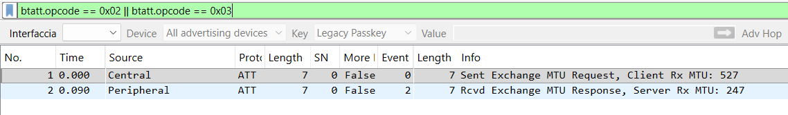
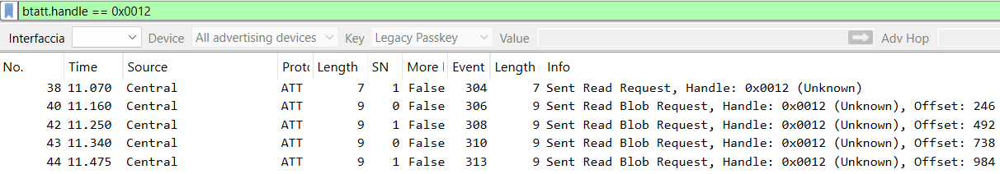
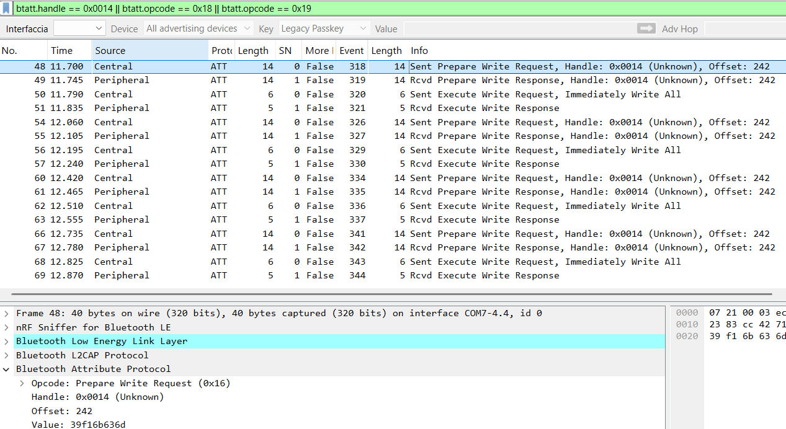
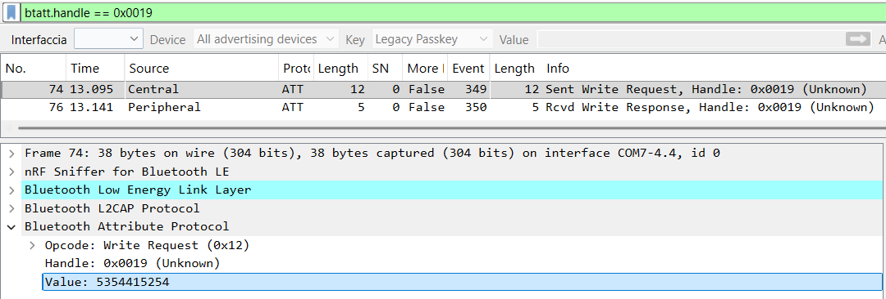
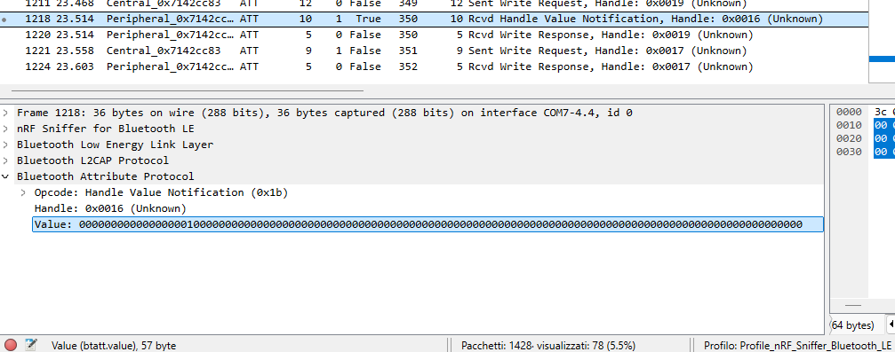

# PQ-BLE-HANDSHAKE

**Post-quantum secure-channel proof of concept over Bluetooth Low Energy GATT.**

PQ-BLE-HANDSHAKE demonstrates how a post-quantum application-layer handshake can be transported over standard BLE GATT without modifying the native Bluetooth stack.

The protocol combines:

- **ML-KEM-768** — NIST FIPS 203, security category 3;
- **6-digit SAS Numeric Comparison** — interactive MITM detection;
- **HKDF-SHA256** — session-key derivation;
- **AES-256-GCM** — authenticated encryption with AAD;
- **monotonic sequence numbers** — replay and out-of-order protection;
- **session resumption** — time- and usage-bounded cached sessions.

> [!IMPORTANT]
> The Python implementation validates the complete cryptographic protocol.
> The current nRF54L15 DK firmware validates the real BLE/GATT transport path,
> but it does **not** yet perform ML-KEM decapsulation, HKDF or AES-GCM on-chip.

---

## Project status

| Component | Status |
|---|---|
| Python cryptographic protocol | ✅ Implemented and tested |
| AES-256-GCM secure channel with AAD | ✅ Implemented and tested |
| Replay and out-of-order protection | ✅ Implemented and tested |
| Session resumption store | ✅ Implemented and tested |
| Re-handshake after 24 hours or 100 successful resumes | ✅ Implemented and tested |
| PC central ↔ nRF54L15 DK BLE/GATT demo | ✅ Validated on real hardware |
| nRF Connect Mobile manual GATT inspection | ✅ Completed |
| nRF52840 Dongle + Wireshark passive capture | ✅ Completed |
| Wireshark screenshots and `.pcapng` evidence | ✅ Included |
| Reproducible benchmark suite | ✅ Completed |
| LaTeX report and compiled PDF | ✅ Included |
| ML-KEM decapsulation on nRF54L15 DK | ⏳ Future work |
| HKDF and AES-256-GCM on nRF54L15 DK | ⏳ Future work |
| Persistent session storage on the DK | ⏳ Future work |

Current active automated test suite:

```text
101 passed
```

---

## Validation model

The project is validated at three distinct levels.

### 1. Cryptographic and protocol validation

The Python implementation covers:

- ML-KEM-768 key generation, encapsulation and decapsulation;
- SAS derivation and comparison;
- HKDF-SHA256 session-key derivation;
- AES-256-GCM encryption and decryption;
- AAD binding;
- direction separation;
- session binding;
- message-type binding;
- replay and out-of-order rejection;
- fragmentation and reassembly;
- session persistence, expiry and bounded resumption;
- MITM simulations;
- mocked GATT transport.

### 2. Real BLE/GATT hardware validation

Validated setup:

```text
Windows PC + Python/Bleak  <---- BLE/GATT ---->  nRF54L15 DK + Zephyr
```

The PC central successfully:

1. discovers `PQ-BLE-Device`;
2. connects to the nRF54L15 DK;
3. uses an ATT MTU of 247;
4. reads the 1184-byte ML-KEM public key;
5. verifies the public-key SHA-256 fingerprint;
6. performs ML-KEM encapsulation on the PC;
7. generates a 1088-byte ciphertext;
8. writes the ciphertext in 5 PQ-BLE fragments;
9. derives the SAS and session key on the PC side;
10. sends the `START` control command;
11. receives a 57-byte raw notification from the DK.

Observed result:

```text
Read public key: 1184 bytes
Encapsulate: ct=1088 bytes, ss=32 bytes
Writing ciphertext: 1088 bytes in 5 fragments
Raw demo notification received: 57 bytes
BLE/GATT transport validation completed.
```

The complete execution log is available in
[`docs/hardware-validation-log.txt`](docs/hardware-validation-log.txt).

### 3. Passive packet-level validation

The BLE exchange was captured with:

- **nRF52840 Dongle**;
- **nRF Sniffer for Bluetooth LE**;
- **Wireshark**.

The capture confirms:

- ATT MTU negotiation;
- public-key long read;
- ciphertext transfer;
- `START` control write;
- final Handle Value Notification.

Capture files:

- [`docs/captures/Cattura_PQ_BLE.pcapng`](docs/captures/Cattura_PQ_BLE.pcapng)
- [`docs/captures/Cattura_PQ_BLE_filtro_btatt.pcapng`](docs/captures/Cattura_PQ_BLE_filtro_btatt.pcapng)

---

## Hardware architecture

```text
                         passive capture
                    +-----------------------+
                    |                       v
Windows PC          |                 nRF52840 Dongle
Python + Bleak      |                 Wireshark / nRF Sniffer
Central / Client    |
        |
        +------------- BLE/GATT ------------+
                                           |
                                           v
                                  nRF54L15 DK
                                  Zephyr Peripheral
                                  Custom GATT Server
```

| Role | Hardware | Software | Purpose |
|---|---|---|---|
| Central | Windows PC | Python + Bleak | Protocol orchestration and ML-KEM encapsulation |
| Peripheral | nRF54L15 DK | Zephyr / nRF Connect SDK | Real GATT transport validation |
| Sniffer | nRF52840 Dongle | Wireshark + nRF Sniffer | Passive ATT/GATT observation |

The nRF52840 Dongle is used **only as a passive sniffer**.

The Python peripheral under `experimental/peripheral/` is not part of the real
hardware demo.

---

## Firmware public key

The nRF54L15 firmware embeds a **valid ML-KEM-768 public key generated
offline**.

The key is generated with:

```powershell
python scripts\generate_firmware_public_key.py
```

The generated header is stored in:

```text
firmware/nrf54l15_pq_gatt_skeleton/src/demo_public_key.h
```

The PC central logs the SHA-256 fingerprint of the public key read over BLE.
This fingerprint can be compared with the value recorded in the generated
header.

> [!NOTE]
> The corresponding ML-KEM secret key is intentionally not stored in the
> repository or on the DK. Therefore, the current firmware cannot decapsulate
> the ciphertext. The public key is real, while the embedded demo remains a
> BLE/GATT transport validation rather than a complete embedded cryptographic
> endpoint.

The final 57-byte notification is explicitly a **raw demo payload** used to
validate the GATT notification path. It is not an AES-GCM payload generated
from a session key shared with the DK.

---

## GATT service

Service UUID:

```text
12345678-1234-1234-1234-123456789abc
```

| Characteristic | UUID suffix | Properties | Value handle | Purpose |
|---|---|---|---:|---|
| Public Key | `9abd` | READ | `0x0012` | Exposes the 1184-byte ML-KEM public key |
| Ciphertext | `9abe` | WRITE | `0x0014` | Receives the 1088-byte ciphertext |
| Secure Data | `9abf` | NOTIFY | `0x0016` | Sends the 57-byte raw demo notification |
| Secure Data CCCD | — | READ/WRITE | `0x0017` | Enables notifications |
| Control | `9ac0` | WRITE | `0x0019` | Receives `START` and resume messages |

The observed handle layout is:

```text
0x0010  Custom service
0x0011  Public Key declaration
0x0012  Public Key value
0x0013  Ciphertext declaration
0x0014  Ciphertext value
0x0015  Secure Data declaration
0x0016  Secure Data value / notification handle
0x0017  Secure Data CCCD
0x0018  Control declaration
0x0019  Control value
```

---

## Wireshark evidence

### ATT MTU exchange



### ML-KEM public-key long read



The 1184-byte key is transferred through an ATT Read followed by Read Blob
operations at offsets:

```text
0, 246, 492, 738, 984
```

### ML-KEM ciphertext transfer



The PC central splits the 1088-byte ciphertext into 5 application-level
fragments with the validated MTU:

```text
ATT MTU              = 247 bytes
PQ-BLE header        = 4 bytes
Payload per fragment = 243 bytes
Fragments            = ceil(1088 / 243) = 5
```

On Windows/Bleak, the writes may be represented by Wireshark as ATT Prepare
Write and Execute Write procedures.

### `START` control write



The payload:

```text
53 54 41 52 54
```

is the ASCII encoding of:

```text
START
```

### Final 57-byte notification



The notification is sent through the Secure Data value handle `0x0016`.

Useful display filters:

```text
btatt
btatt.handle == 0x0012
btatt.handle == 0x0014
btatt.handle == 0x0019
btatt.handle == 0x0016
btatt.opcode == 0x1b
```

---

## Protocol overview

### ML-KEM-768 exchange

```text
Peripheral / DK                         Central / PC

exposes valid pk through GATT READ  --> read pk
                                        encapsulate(pk) -> ct, ss
receives ct through GATT WRITE      <-- write ct
```

In the complete protocol, the peripheral would decapsulate:

```text
decapsulate(sk, ct) -> ss
```

This final step is not yet executed on the nRF54L15 DK.

ML-KEM-768 sizes:

| Object | Size |
|---|---:|
| Public key | 1184 B |
| Secret key | 2400 B |
| Ciphertext | 1088 B |
| Shared secret | 32 B |


### SAS Numeric Comparison

```text
transcript = public_key || ciphertext || shared_secret
sas = SHA256(transcript)[0:4] mod 1_000_000
```

The six-digit value must be compared by the users or endpoints. A mismatch
aborts the handshake.

### Session-key derivation

```text
session_key = HKDF-SHA256(shared_secret)
```

### AES-256-GCM secure channel

AAD:

```text
session_id (16) || sender_role (1) || seq_num (8) || msg_type (1)
```

Wire format:

```text
seq_num (8) || msg_type (1) || iv (12) || ciphertext || tag (16)
```

Authenticated metadata provides:

- replay protection;
- out-of-order rejection;
- direction separation;
- cross-session protection;
- message-type binding.

---
## Where the post-quantum overhead is paid

The large post-quantum objects are exchanged only during a full
handshake:

| Object | Size |
|---|---:|
| ML-KEM-768 public key | 1184 B |
| ML-KEM-768 ciphertext | 1088 B |
| Cryptographic material | 2272 B |
| Application material at MTU 247 | 2292 B |

After the session key has been derived, ML-KEM is no longer used for
ordinary application data.

The AES-256-GCM secure-channel wire format adds a fixed 37-byte
overhead:

```text
seq_num (8) || msg_type (1) || IV (12) ||
ciphertext || GCM tag (16)

---

## Session resumption

The Python implementation stores:

```text
session_id -> session_key
```

A cached session is valid until the first of these limits is reached:

- **24 hours**;
- **100 successful resumptions**.

The usage counter is incremented only after a positive `RESUME_OK` response.
Timeouts and failed resume attempts do not consume the counter.

After the 100th successful resume, the cached entry is removed and the next
connection requires a full ML-KEM handshake.

The current nRF54L15 firmware does not yet implement on-device session
resumption, so hardware resume attempts fall back to the full transport demo.

### Forward-secrecy trade-off

Resumption reuses an existing session key and therefore does not provide full
forward secrecy for resumed sessions. Compromise of the cached key exposes all
traffic protected with that key until the next full handshake. Time- and
usage-based re-handshake limits reduce this exposure window.

---

## Automated tests

Run the complete suite:

```bash
python -m pytest tests/ -v
```

Expected result:

```text
101 passed
```

| Test module | Tests | Scope |
|---|---:|---|
| `test_ml_kem.py` | 6 | ML-KEM key generation, encapsulation and decapsulation |
| `test_fragmentation.py` | 14 | Fragmentation and reassembly |
| `test_sas.py` | 12 | SAS derivation, comparison and formatting |
| `test_session.py` | 22 | HKDF, AES-GCM, AAD, replay and tampering |
| `test_session_store.py` | 23 | Persistence, expiry, usage limit and resumption |
| `test_handshake_mock.py` | 2 | Complete mocked handshake |
| `test_mitm_simulation.py` | 2 | SAS-based MITM detection |
| `test_firmware_uuids.py` | 3 | Firmware name, SMP configuration and notification path |
| `test_central_transport_mock.py` | 17 | Mocked GATT read/write transport |
| **Total** | **101** | Active automated suite |

Strict legacy UUID-parser tests remain disabled because they target an older
firmware declaration format. UUID consistency is additionally verified through
the source code, nRF Connect Mobile, the hardware log and the Wireshark capture.

---

## Benchmarks

The repository includes reproducible benchmarks for:

- ML-KEM key generation, encapsulation and decapsulation;
- SAS and HKDF latency;
- AES-256-GCM CPU throughput;
- fragmentation and reassembly;
- MTU 247 versus MTU 512;
- application-layer wire overhead.

### Windows PowerShell

```powershell
.\.venv\Scripts\activate
.\benchmarks\run_all.ps1
```

### Linux

```bash
source .venv/bin/activate
bash benchmarks/run_all.sh
```

Results are stored in [`benchmarks/results/`](benchmarks/results/):

```text
environment.txt
handshake.txt
handshake_latency.json
throughput.txt
throughput.json
fragmentation.txt
fragmentation_overhead.json
latest.txt
```

Interpretation:

- the handshake benchmark measures **cryptographic CPU latency**, excluding BLE
  scan, connection and GATT transfer;
- the throughput benchmark measures **AES-256-GCM CPU throughput**, not BLE
  radio throughput;
- the fragmentation benchmark compares the hardware-validated MTU 247 with
  MTU 512;
- the secure-channel wire overhead is 37 bytes:
  `seq(8) + msg_type(1) + IV(12) + tag(16)`.

---

## Report

The complete Italian academic report is available in LaTeX and PDF format:

- [LaTeX source](report/tesina_pq_ble_handshake_finale.tex)
- [Compiled PDF](report/tesina_pq_ble_handshake_finale.pdf)

The report includes the protocol design, threat model, implementation,
automated tests, hardware validation, Wireshark evidence, limitations and future
work.

---

## Quick start

### Windows PowerShell

```powershell
git clone https://github.com/AleBonora3/pq-ble-handshake.git
cd pq-ble-handshake

python -m venv .venv
.\.venv\Scripts\activate
pip install -r requirements.txt

python -m pytest tests\ -v
```

Run the hardware central:

```powershell
python -m src.central.main `
    --device PQ-BLE-Device `
    --demo `
    --no-sas-confirm `
    --log-level DEBUG
```

Run all benchmarks:

```powershell
.\benchmarks\run_all.ps1
```

### Linux

```bash
git clone https://github.com/AleBonora3/pq-ble-handshake.git
cd pq-ble-handshake

python3 -m venv .venv
source .venv/bin/activate
pip install -r requirements.txt

python -m pytest tests/ -v
```

---

## nRF54L15 DK firmware

Firmware directory:

```text
firmware/nrf54l15_pq_gatt_skeleton/
```

Build and flash:

```bash
cd firmware/nrf54l15_pq_gatt_skeleton
west build -b nrf54l15dk/nrf54l15/cpuapp -p always
west flash
```

On Windows, a short path is recommended to avoid Zephyr/NCS path-length
problems:

```powershell
Copy-Item -Recurse `
    firmware\nrf54l15_pq_gatt_skeleton `
    C:\myfw\pq

cd C:\myfw\pq
west build -b nrf54l15dk/nrf54l15/cpuapp -p always
west flash
```

Validated environment:

```text
Board: nrf54l15dk/nrf54l15/cpuapp
SDK:   nRF Connect SDK 3.0.0
```

---

## Repository structure

```text
pq-ble-handshake/
├── src/
│   ├── common/                  # ML-KEM, SAS, HKDF, AES-GCM, sessions
│   └── central/                 # Bleak central and hardware demo
├── experimental/
│   └── peripheral/              # Experimental Python peripheral
├── firmware/
│   └── nrf54l15_pq_gatt_skeleton/
│       ├── src/
│       │   ├── main.c
│       │   └── demo_public_key.h
│       ├── CMakeLists.txt
│       ├── prj.conf
│       └── README.md
├── scripts/
│   ├── generate_firmware_public_key.py
│   └── generate_demo_vectors.py
├── tests/                       # 101 active tests
├── benchmarks/
│   ├── results/                 # Measured TXT/JSON artifacts
│   └── run_all.ps1
├── docs/
│   ├── captures/                # Wireshark .pcapng files
│   ├── images/                  # Wireshark screenshots
│   ├── hardware-validation-log.txt
│   ├── protocol-spec.md
│   ├── security-analysis.md
│   ├── test-results.md
│   └── testing-guide.md
├── report/
│   ├── tesina_pq_ble_handshake_finale.tex
│   └── tesina_pq_ble_handshake_finale.pdf
└── README.md
```

---

## Security scope and limitations

- The protocol is a research proof of concept, not a Bluetooth SIG standard.
- BLE SMP is intentionally disabled in the DK firmware:
  `CONFIG_BT_SMP=n`.
- The current demo provides application-layer design and transport validation,
  not BLE link-layer encryption.
- The nRF54L15 DK does not yet perform ML-KEM decapsulation.
- The nRF54L15 DK does not yet derive the session key or produce AES-GCM
  ciphertext.
- The final DK notification is a raw transport-demo payload.
- SAS requires human comparison and does not scale to large unattended IoT
  deployments.
- Session resumption reduces the frequency of full handshakes but weakens
  forward secrecy until re-handshake.
- Side-channel resistance, energy measurements and embedded RNG evaluation are
  outside the current implementation scope.

---

## Roadmap

### Completed

- [x] ML-KEM-768 Python implementation through liboqs
- [x] SAS Numeric Comparison
- [x] HKDF-SHA256 session-key derivation
- [x] AES-256-GCM with authenticated metadata
- [x] replay and out-of-order protection
- [x] session resumption store
- [x] 24-hour re-handshake limit
- [x] 100-successful-resume limit
- [x] GATT fragmentation and reassembly
- [x] 101 automated tests
- [x] nRF54L15 DK Zephyr firmware build
- [x] firmware flash and phone inspection
- [x] Windows PC ↔ nRF54L15 DK demo
- [x] valid offline-generated ML-KEM public key in firmware
- [x] public-key fingerprint verification over BLE
- [x] nRF52840/Wireshark passive capture
- [x] `.pcapng` evidence
- [x] five Wireshark screenshots
- [x] reproducible benchmark suite and measured result files
- [x] LaTeX report and compiled PDF

### Future work

- [ ] ML-KEM decapsulation on the nRF54L15 DK
- [ ] HKDF and AES-256-GCM on-chip
- [ ] persistent session store in DK flash
- [ ] end-to-end encrypted DK notification
- [ ] ML-DSA-based non-interactive authentication
- [ ] hybrid ECDH + ML-KEM handshake
- [ ] embedded latency, RAM, flash and energy benchmarks
- [ ] side-channel evaluation
- [ ] formal verification with ProVerif or Tamarin

---

## Author

**Alessio Bonora**

Project developed for the *Network Security* course, M.Sc. in Computer
Security, A.Y. 2025/2026.
